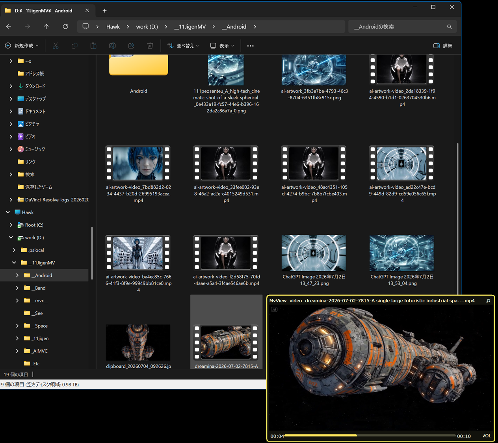
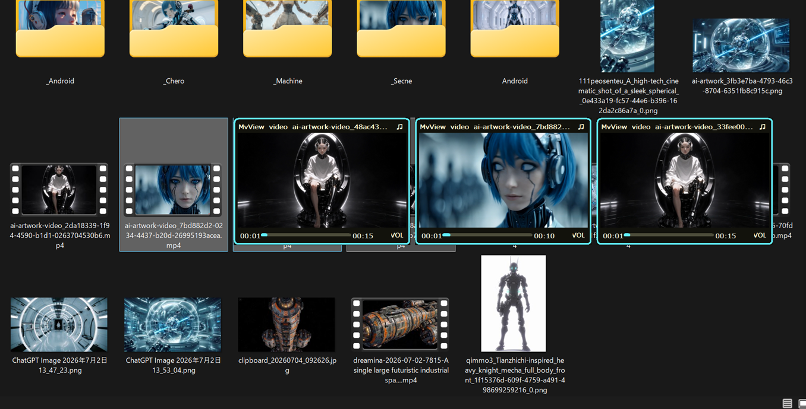

# MvView v0.30

[English](README.en.md)





*複数メディアのプレビュー*

MvView は、Windows 11 Explorer のファイル一覧でメディア項目へカーソルを置くと、libmpv を使って画像・動画・音声を小窓プレビューする C++ / Win32 常駐アプリです。

## v0.30 の変更点

- 設定ダイアログへ「Preview 位置」を追加
- 「左上」「右上」「中央」「左下」「右下」から表示位置を選択可能
- 単体プレビューと最大9件の複数タイルプレビューの両方へ設定位置を反映
- 各表示位置はマウスカーソルを基準とし、画面外へ出る場合だけ現在のモニターの作業領域内へ補正
- 既存設定ファイルでは、初期値として従来の見え方に近い「右上」を使用

## 主な機能

- Explorer が前面にある場合だけメディア項目のホバーを監視
- UI Automation と Shell View の両方を使い、完全なファイルパスを安全に特定
- 画像、動画、音声を libmpv でプレビュー
- Ctrl / Shift による複数選択は確認後に最大9件をタイル表示
- 対象から離れたときの自動終了、プレビュー上へのポインター移動、待機時間、Preview位置などを設定可能
- `--open` と世代管理付き UTF-16 JSON `WM_COPYDATA` Hover IPC に対応
- GitHub Releases の更新通知に対応

## 対応メディア

| 種類 | 拡張子 |
|---|---|
| 画像 | `.jpg` `.jpeg` `.png` `.webp` `.bmp` `.gif` `.tif` `.tiff` |
| 動画 | `.mp4` `.mkv` `.mov` `.avi` `.webm` `.m4v` `.wmv` `.flv` `.ts` `.mts` `.m2ts` `.mpg` `.mpeg` |
| 音声 | `.mp3` `.wav` `.flac` `.m4a` `.aac` `.ogg` `.opus` `.wma` `.aiff` |

## 使い方

1. Release から ZIP をダウンロードして展開します。
2. `MvView.exe` を起動します。
3. Explorer のメディア項目へカーソルを置き、設定した待機時間だけ静止します。
4. 項目から離れるとプレビューを閉じます。設定でプレビュー上への移動も許可できます。

クリックや選択変更だけではプレビューを開始しません。パスを一意に確定できない項目も安全のため再生しません。

## プレビュー操作

- クリック: 一時停止 / 再生
- ホイール: 再生位置を前後
- Ctrl + ホイール: 一時的に解像度変更
- 音量表示をクリック: 縦型音量スライダー
- Esc: プレビューを閉じる
- 複数プレビュー: 最大9件

## 設定

設定ファイル:

```text
%APPDATA%\MvView\settings.json
```

主な設定:

- ホバーでプレビュー
- ホバー開始までの時間（0～5000ms）
- 対象から外れたらすぐ停止
- 複数選択時に確認する
- プレビュー上への移動を許可
- プレビュー開始時の音声
- Preview 解像度
- プレビュー枠色
- Preview 位置

## DirectOpen

外部アプリや PowerShell から直接開けます。

```powershell
MvView.exe --open "D:\media\sample.mp4"
```

既に MvView が常駐している場合は、2つ目のプロセスから既存プロセスへパスを渡します。

## External hover IPC

従来の DirectOpen は `WM_COPYDATA` の `dwData == 1` を使用します。外部 Hover クライアントは `dwData == 0x4D564831` (`MVH1`) と、null 終端 UTF-16 JSON を使用します。

プロトコル `mvview-hover` version `1` は `hover_open`、`hover_update`、`hover_move`、`hover_close` を提供します。リクエストは `source_pid`、`request_id`、単調増加する `generation` を含み、古いリクエストは無視されます。

## libmpv

### インストール

MvView は 64-bit 版の libmpv を使用します。

1. [mpv公式のWindows向けインストール案内](https://mpv.io/installation/)から、案内先の [shinchiro Windows builds](https://github.com/shinchiro/mpv-winbuild-cmake/releases/latest) を開きます。
2. 最新ReleaseのAssetsから `mpv-dev-x86_64-...7z` をダウンロードします。`x86_64-v3`版は新しいCPU向けのため、判断に迷う場合は通常の`x86_64`版を選んでください。
3. [7-Zip](https://www.7-zip.org/)などで展開し、含まれている `mpv-2.dll` を `MvView.exe` と同じフォルダーへコピーします。
4. `MvView.exe` を起動し、メディアをプレビューできることを確認します。

配布物によってDLL名が `libmpv-2.dll` の場合は、その名前のまま配置できます。DLLは信頼できる配布元から取得し、32-bit（`i686`）版は使用しないでください。

次の順に DLL を検索します。

```text
MvView.exe と同じフォルダーの mpv-2.dll
MvView.exe と同じフォルダーの libmpv-2.dll
runtime\mpv-2.dll
runtime\libmpv-2.dll
PATH 上の mpv-2.dll / libmpv-2.dll
```

DLL が無い場合も MvView はトレイ起動しますが、再生には libmpv runtime が必要です。

## ビルド

必要環境:

- Windows 11
- Visual Studio / Build Tools
- Desktop development with C++
- Windows SDK

```powershell
Set-ExecutionPolicy -Scope Process Bypass -Force
.\build.ps1 -Configuration Release -Publish
```

出力:

```text
bin\x64\Release\MvView.exe
publish\MvView_v0.30\
publish\MvView_v0.30_YYYYMMDD_HHMMSS.zip
```

## 更新確認

起動後、バックグラウンドで `cyfomix-ui/MvView` の最新 GitHub Release を1回確認します。最新版が現在の `version.xml` より新しい場合だけ通知し、［Download］で Release の ZIP、または Release ページを開きます。通信できない場合は起動を妨げず、通知も表示しません。

## ログ

```text
%APPDATA%\MvView\logs\MvView.log
```

## 既知の制限

- UI Automation 名と Shell 表示名から完全なパスを一意に確定できない項目は再生しません。
- 仮想項目、未取得のクラウド項目、ファイルシステムパスを持たない項目は対象外です。
- Windows 11 Explorer の内部 UI 変更により、表示モードごとの調整が必要になる場合があります。

## Version 管理

- 現在の Version: `v0.30`
- `version.xml` を唯一の Version 元とします。
- タスクトレイ Tooltip、About、Splash、EXE リソース、配布名へ同じ Version を反映します。
